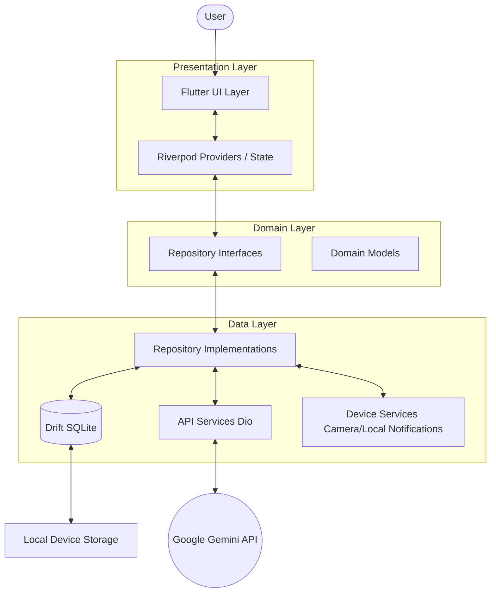

# Arsitektur Teknis Noma: Aplikasi Pencatatan Uang Berbasis AI

## Status Implementasi Saat Ini - 7 Agustus 2026

Arsitektur yang berjalan saat ini adalah Flutter + Riverpod + Drift dengan pola feature-first. Beberapa bagian di bawah masih menjelaskan target ideal, jadi status aktualnya perlu dicatat:

- Layer domain formal belum lengkap. Implementasi saat ini lebih dekat ke "Clean Architecture Lite": screen/widget -> Riverpod provider/controller -> repository -> Drift/API service.
- Database lokal sudah memakai Drift dengan conditional connection untuk native dan web.
- Provider global yang aktif: `databaseProvider` dan `geminiApiServiceProvider`.
- AI service aktif mendukung Gemini, Groq, dan OpenRouter berdasarkan prefix API key. Dokumentasi lama yang menyebut hanya Gemini perlu dibaca sebagai target awal.
- Notifikasi harian memakai `flutter_local_notifications.zonedSchedule`. `workmanager` belum menjadi dependency aktif dan belum digunakan di kode.
- Fitur AI tetap client-side. Untuk production publik, API key client-side harus diperlakukan sebagai risiko dan idealnya dipindah ke backend proxy.

Dokumen ini menguraikan arsitektur teknis lengkap untuk aplikasi **Noma**, aplikasi pencatatan keuangan pintar berbasis AI untuk perangkat Android.

## 1. Gambaran Umum Arsitektur

Noma menggunakan arsitektur modern berbasis Flutter dengan pendekatan reaktif menggunakan Riverpod. Data disimpan secara lokal di perangkat menggunakan Drift (SQLite), dan memanfaatkan kekuatan AI melalui integrasi langsung ke Google Gemini API dari sisi klien.

### Diagram Aliran Data



## 2. Struktur Folder Project

Proyek Noma menggunakan pendekatan **Feature-First** (pengelompokan berdasarkan fitur) yang dipadukan dengan struktur Clean Architecture sederhana di dalam setiap fitur.

```text
lib/
├── main.dart                      # Titik masuk utama aplikasi, inisialisasi awal
├── app.dart                       # Konfigurasi MaterialApp, routing, dan tema utama
├── core/                          # Kode inti yang digunakan di seluruh aplikasi
│   ├── constants/                 # Konstanta global (kunci API, nama tabel, dll)
│   ├── theme/                     # Definisi tema, warna, tipografi, dan gaya UI
│   ├── utils/                     # Fungsi utilitas/helper, formatters (tanggal, mata uang)
│   └── services/                  # Layanan pihak ketiga (Dio setup, Device services, Workmanager)
├── features/                      # Modul fitur utama aplikasi
│   ├── transaction/               # Fitur inti pencatatan dan manajemen transaksi
│   │   ├── data/                  # Implementasi repository, Data sources lokal (Drift DAOs)
│   │   ├── domain/                # Model data, antarmuka Repository, Entity
│   │   └── presentation/          # Screen (layar), Widget spesifik fitur, Riverpod state
│   ├── receipt_scanner/           # Fitur pemindaian struk dengan Gemini Vision
│   │   ├── data/
│   │   ├── domain/
│   │   └── presentation/
│   ├── chatbot/                   # Fitur asisten virtual AI untuk interaksi keuangan
│   │   ├── data/
│   │   ├── domain/
│   │   └── presentation/
│   ├── report/                    # Fitur analitik dan laporan grafik visual
│   │   ├── data/
│   │   ├── domain/
│   │   └── presentation/
│   └── settings/                  # Fitur pengaturan aplikasi (tema, notifikasi, dll)
│       ├── data/
│       ├── domain/
│       └── presentation/
└── shared/                        # Komponen yang dibagikan antar fitur
    ├── widgets/                   # UI komponen reusable (Button kustom, Glassmorphic card, dll)
    ├── models/                    # Model data yang digunakan lintas fitur (contoh: UserModel)
    └── providers/                 # Provider global (contoh: Database provider, Dio provider)
```

## 3. Layer Architecture (Clean Architecture Lite)

Noma mengimplementasikan versi sederhana dari Clean Architecture untuk menjaga pemisahan tanggung jawab (Separation of Concerns).

### a. Presentation Layer
Terdiri dari Flutter Widgets dan Riverpod Providers. Bertanggung jawab atas UI dan interaksi pengguna.
- **Widgets/Screens**: Hanya merender UI dan mendengarkan (listen) state dari provider. Tidak memiliki logika bisnis yang kompleks.
- **Providers**: Mengatur *state* untuk UI, menangani *user intent*, dan berkomunikasi dengan Domain/Repository layer.

### b. Domain Layer
Merupakan jantung aplikasi, murni Dart (tanpa dependensi UI atau Database spesifik).
- **Entities/Models**: Representasi objek bisnis (contoh: `Transaction`, `Category`).
- **Repositories Interfaces**: Mendefinisikan kontrak (abstract class) tentang bagaimana data diambil atau disimpan, tanpa mengetahui implementasinya.

### c. Data Layer
Bertanggung jawab atas pengadaan data dan komunikasi eksternal.
- **Data Sources**: Komunikasi langsung dengan database lokal (Drift) atau API eksternal (Dio).
- **Repository Implementations**: Implementasi nyata dari antarmuka di Domain layer. Memutuskan apakah akan mengambil data dari cache lokal atau jaringan.

## 4. Desain Database Lokal (Drift / SQLite)

Aplikasi Noma bekerja secara offline-first. Seluruh data transaksi, kategori, dan preferensi pengguna disimpan di perangkat.
Drift dipilih karena memberikan keunggulan *reactive streams* (dapat langsung disalurkan ke UI via Riverpod) dan *type-safety* untuk query SQLite.

*(Catatan: Rincian skema tabel, relasi, dan DAO didokumentasikan di file terpisah: [`database.md`](./database.md)).*

## 5. Aliran Integrasi AI (Google Gemini Flash)

Noma sangat bergantung pada integrasi Gemini API untuk memfasilitasi pencatatan cerdas. Semua komunikasi dengan Gemini dikelola di layer `Data` melalui *HTTP Client* (Dio).

### a. Aliran Pencatatan Teks Natural
1. User mengetik "Makan siang pakai ayam goreng 25 ribu".
2. **Presentation**: Meneruskan teks ke `TransactionProvider`.
3. **Data**: Memanggil Gemini API dengan *System Prompt* spesifik untuk mengekstrak entitas (nominal: 25000, tipe: pengeluaran, kategori: makanan, catatan: "Makan siang pakai ayam goreng").
4. Gemini merespons dalam format JSON.
5. JSON di-*parse* menjadi objek `Transaction`.
6. UI menampilkan *draft* transaksi untuk dikonfirmasi pengguna.
7. Setelah konfirmasi, disimpan ke database lokal via Drift.

### b. Aliran Pemindaian Struk (Receipt Scanner)
1. User mengambil foto dari kamera atau memilih dari galeri menggunakan `image_picker`.
2. Gambar yang diambil, di-encode ke base64 (atau format multipart yang didukung API).
3. **Data Layer**: Mengirim gambar ke **Gemini Vision (Pro/Flash)** beserta prompt untuk mengekstrak data item, total, pajak, dan tanggal.
4. Response AI (JSON) diubah menjadi model transaksi atau daftar item.
5. User melakukan *review* di layar aplikasi (Presentation Layer).
6. User menekan 'Simpan', data dimasukkan ke Drift.

### c. Aliran Chatbot (Asisten Keuangan)
1. User mengirimkan pertanyaan: "Berapa total pengeluaran saya minggu ini untuk makanan?".
2. **Domain/Data Layer**: Aplikasi secara lokal melakukan query ke Drift untuk mengambil ringkasan data transaksi minggu ini.
3. Aplikasi menggabungkan data transaksi mentah/ringkasan (sebagai *context*) dengan pertanyaan pengguna (sebagai *prompt*).
4. Prompt lengkap dikirim ke Gemini.
5. Gemini memproses data dan menghasilkan bahasa natural.
6. Respons ditampilkan pada UI chat dengan gaya Glassmorphism yang mulus.

## 6. Aliran Sistem Notifikasi

Untuk mengingatkan pengguna agar mencatat keuangan, Noma menggunakan notifikasi lokal yang dijadwalkan secara background.

Status implementasi saat ini:

1. **Setup Awal**: `main.dart` menginisialisasi `NotificationService.initialize()` pada platform non-web.
2. **Scheduling**: `SettingsScreen` menyimpan preferensi notifikasi ke `SharedPreferences` dan memanggil `NotificationService.scheduleDailyReminder(hour, minute)`.
3. **Eksekusi**: Jadwal harian dibuat dengan `flutter_local_notifications.zonedSchedule` dan timezone `Asia/Jakarta`.
4. **Interaction**: Saat notifikasi diketuk, payload diarahkan ke route tambah transaksi melalui `appRouter.go(AppRoutes.addTransaction)`.
5. **Catatan**: `workmanager` belum digunakan. Jika butuh ringkasan dinamis berdasarkan total pengeluaran hari ini saat aplikasi tertutup, perlu background task tambahan atau strategi scheduling ulang.

## 7. Dependency Injection & Arsitektur Provider

Noma sepenuhnya menggunakan ekosistem `flutter_riverpod` sebagai *State Management* dan kerangka kerja *Dependency Injection*.

- **Global Providers**: Didefinisikan di `lib/shared/providers/` (misal: `databaseProvider`, `dioProvider`, `sharedPreferencesProvider`).
- **Feature Providers**: Didefinisikan di setiap folder fitur (misal: `transactionRepositoryProvider`, `transactionListProvider`).
- **Scoping**: Modul Riverpod mengatasi masalah referensi dependensi dengan memungkinkan injeksi satu provider ke provider lain secara langsung via parameter `ref`.

## 8. Daftar Package / Dependensi Utama

Berikut adalah teknologi pendukung utama beserta alasan pemilihannya:

| Package | Perkiraan Versi | Deskripsi & Alasan Pemilihan |
|---|---|---|
| **flutter_riverpod** | `^2.5.1` | State management dan DI modern, aman (compile-safe), scalable, dan mudah di-test. |
| **drift** | `^2.14.0` | Wrapper SQLite reaktif dan *type-safe* di Dart. Sempurna untuk aplikasi *offline-first*. |
| **sqlite3_flutter_libs** | `^0.5.18` | Distribusi binari SQLite bawaan standar terbaru untuk Drift di platform Android/iOS. |
| **dio** | `^5.4.0` | HTTP Client mumpuni untuk interaksi dengan Gemini API, mendukung interceptor (untuk logging/auth), FormData, dan *error handling* rinci. |
| **go_router** | `^12.1.1` | Sistem *routing* deklaratif standar industri, sangat mempermudah penanganan navigasi berdasar URL, tab, dan *deep linking*. |
| **google_fonts** | `^6.1.0` | Akses cepat dan dinamis ke tipografi Google Font (seperti Poppins atau Inter) untuk estetika UI. |
| **image_picker** | `^1.0.4` | Plugin standar dari tim Flutter untuk mengakses galeri dan kamera Android untuk memindai struk. |
| **flutter_local_notifications** | `^17.0.0` | Menangani push notifikasi sistem lokal Android yang kaya fitur secara *offline*. |
| **workmanager** | `^0.5.2` | Wrapper fleksibel untuk Android *WorkManager*, memungkinkan eksekusi kode background periodik/terjadwal dengan keandalan tinggi. |
| **freezed** | `^2.4.5` | Code generator untuk *data-classes/unions/pattern-matching* yang membuat model domain lebih kokoh dan minim *boilerplate*. |
| **fl_chart** | `^0.68.0` | Library chart/grafik untuk Flutter — digunakan di halaman Laporan untuk menampilkan Bar Chart pemasukan vs pengeluaran dan Donut Chart kategori pengeluaran. |
| **flutter_dotenv** | `^5.1.0` | Memuat variabel environment dari file `.env` — digunakan untuk menyimpan API Key Gemini secara aman di luar source code. |

## 9. Strategi Penanganan Kesalahan (Error Handling)

- **Domain/Data Level**: Setiap fungsi repository harus menangkap pengecualian asali (seperti `DioException` atau `SqliteException`) dan mengubahnya menjadi *custom exception* dari ranah aplikasi Noma (seperti `NetworkFailure`, `DatabaseFailure`, `AIParsingFailure`).
- **Presentation Level**: Provider menangkap kegagalan dan mengemasnya dalam bentuk state asinkron (`AsyncValue.error` di Riverpod). UI kemudian akan bereaksi (misal dengan menampilkan `SnackBar` dengan pesan kesalahan yang ramah pengguna, atau memunculkan halaman *error* khusus untuk mencoba lagi).
- **Graceful Degradation**: Jika koneksi ke Gemini API gagal, Noma harus tetap mengizinkan pencatatan uang secara manual 100%.

## 10. Strategi Pengujian (Testing)

- **Unit Testing**: 
  - Menguji logika *parsing* transaksi (Domain layer).
  - Menguji *StateNotifier* dan transisi *state* provider (menggunakan *ProviderContainer* pada tes).
  - Mocking layer Data (menguji interaksi Repository dengan tiruan database atau HTTP Client menggunakan `mockito`).
- **Widget Testing**: 
  - Menguji komponen visual individual (seperti kartu transaksi dengan *glassmorphism*) untuk memverifikasi penempatan dan ukuran.
- **Integration Testing**: 
  - Alur pencatatan utuh menggunakan antarmuka secara end-to-end (simulasi *input* -> *klik* tombol -> *verifikasi* tampil pada daftar).
