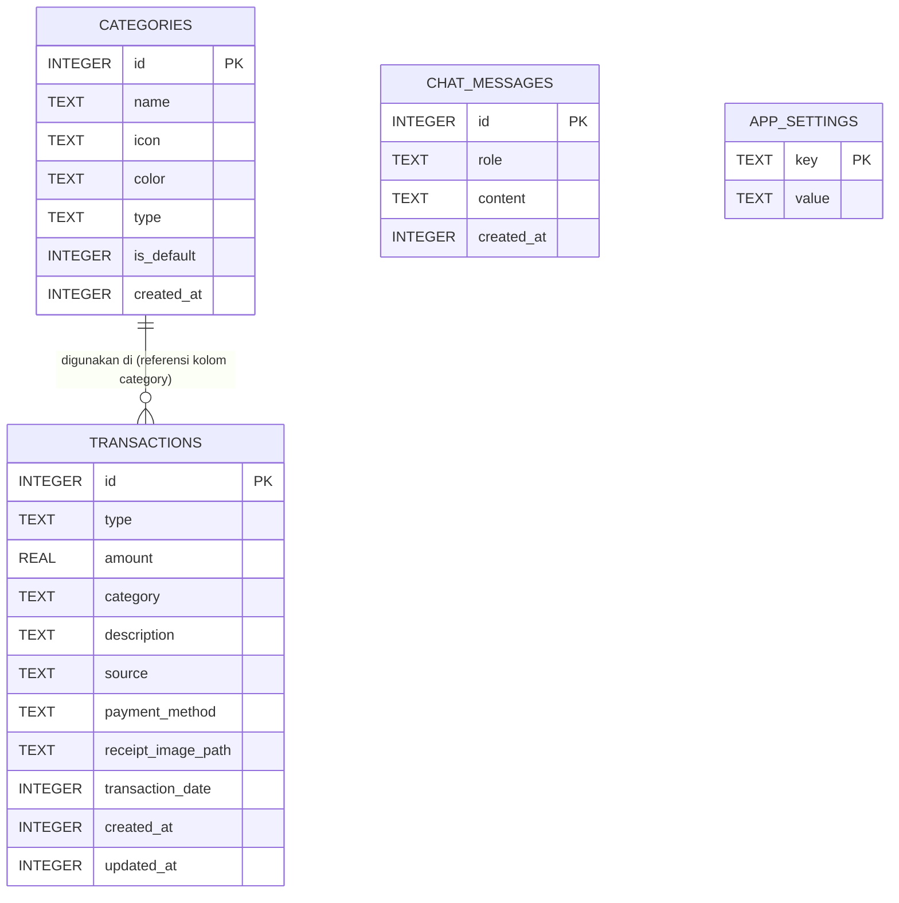

# Desain Skema Database Noma

## 1. Gambaran Umum Database
Aplikasi "Noma" (Aplikasi Pencatatan Uang Berbasis AI) menggunakan database lokal **SQLite** yang diimplementasikan menggunakan **Drift** (wrapper SQLite yang *type-safe* untuk Flutter/Dart). Semua data disimpan 100% secara lokal di perangkat keras pengguna, tanpa adanya sinkronisasi ke server (cloud-free). Pendekatan ini menjamin privasi pengguna dan memastikan aplikasi dapat berjalan secara *offline* sepenuhnya.

## 2. ERD (Entity Relationship Diagram)
Berikut adalah diagram entitas relasi (ERD) dari struktur database Noma:



*Catatan: Meskipun secara konsep `Transactions.category` mereferensikan `Categories.name`, relasi yang digunakan dalam aplikasi ini lebih bersifat longgar (loose coupling) melalui tipe data string untuk menghindari masalah saat kategori dihapus namun historinya ingin tetap dipertahankan secara utuh.*

## 3. Detail Setiap Tabel

### 3.1. Tabel `transactions`
Tabel utama untuk menyimpan riwayat transaksi pengeluaran dan pemasukan.

| Kolom | Tipe (Drift/SQLite) | Constraint / Aturan | Deskripsi |
|---|---|---|---|
| `id` | `INTEGER` | `PRIMARY KEY`, `AUTOINCREMENT` | ID unik transaksi. |
| `type` | `TEXT` | `NOT NULL` | Jenis transaksi: `'income'` atau `'expense'`. |
| `amount` | `REAL` | `NOT NULL` | Nominal transaksi dalam satuan Rupiah (tanpa format). |
| `category` | `TEXT` | `NOT NULL` | Nama kategori transaksi (mis. "Makanan"). |
| `description` | `TEXT` | `NULLABLE` | Catatan, rincian, atau deskripsi tambahan. |
| `source` | `TEXT` | `NOT NULL` | Asal usul input: `'manual'`, `'ai_text'`, atau `'receipt_scan'`. |
| `payment_method` | `TEXT` | `NULLABLE` | Metode pembayaran (misal: `'Tunai'`, `'Gopay'`, `'OVO'`, `'Transfer BCA'`). Diisi otomatis oleh AI atau manual oleh pengguna. |
| `receipt_image_path` | `TEXT` | `NULLABLE` | Path absolut atau relatif foto struk di memori perangkat. |
| `transaction_date` | `INTEGER` | `NOT NULL` | Waktu transaksi terjadi (UNIX Timestamp). |
| `created_at` | `INTEGER` | `NOT NULL` | Waktu baris ini ditambahkan ke DB (UNIX Timestamp). |
| `updated_at` | `INTEGER` | `NOT NULL` | Waktu baris ini terakhir diubah (UNIX Timestamp). |

**Contoh Kode Drift:**
```dart
class Transactions extends Table {
  IntColumn get id => integer().autoIncrement()();
  TextColumn get type => text()(); // 'income' | 'expense'
  RealColumn get amount => real()();
  TextColumn get category => text()();
  TextColumn get description => text().nullable()();
  TextColumn get source => text()(); // 'manual' | 'ai_text' | 'receipt_scan'
  TextColumn get paymentMethod => text().nullable()(); // 'Tunai' | 'Gopay' | 'OVO' | dll
  TextColumn get receiptImagePath => text().nullable()();
  IntColumn get transactionDate => integer()();
  IntColumn get createdAt => integer()();
  IntColumn get updatedAt => integer()();
}
```

### 3.2. Tabel `categories`
Menyimpan definisi daftar kategori pemasukan maupun pengeluaran.

| Kolom | Tipe (Drift/SQLite) | Constraint / Aturan | Deskripsi |
|---|---|---|---|
| `id` | `INTEGER` | `PRIMARY KEY`, `AUTOINCREMENT` | ID unik kategori. |
| `name` | `TEXT` | `NOT NULL`, `UNIQUE` | Nama kategori. |
| `icon` | `TEXT` | `NULLABLE` | Nama identifier ikon Material (mis. 'fastfood'). |
| `color` | `TEXT` | `NULLABLE` | Representasi kode warna (Hex string, mis. '#FF0000'). |
| `type` | `TEXT` | `NOT NULL` | Tipe kategori: `'income'`, `'expense'`, atau `'both'`. |
| `is_default` | `INTEGER` | `NOT NULL`, `DEFAULT(0)` | Status boolean (`1` = Bawaan, `0` = Custom User). |
| `created_at` | `INTEGER` | `NOT NULL` | Waktu pembuatan (UNIX Timestamp). |

**Contoh Kode Drift:**
```dart
class Categories extends Table {
  IntColumn get id => integer().autoIncrement()();
  TextColumn get name => text().unique()();
  TextColumn get icon => text().nullable()();
  TextColumn get color => text().nullable()();
  TextColumn get type => text()(); // 'income' | 'expense' | 'both'
  BoolColumn get isDefault => boolean().withDefault(const Constant(false))();
  IntColumn get createdAt => integer()();
}
```

### 3.3. Tabel `chat_messages`
Menyimpan riwayat obrolan dengan AI untuk pengenalan transaksi.

| Kolom | Tipe (Drift/SQLite) | Constraint / Aturan | Deskripsi |
|---|---|---|---|
| `id` | `INTEGER` | `PRIMARY KEY`, `AUTOINCREMENT` | ID unik pesan. |
| `role` | `TEXT` | `NOT NULL` | Peran pengirim: `'user'` atau `'assistant'`. |
| `content` | `TEXT` | `NOT NULL` | Teks isi dari pesan. |
| `created_at` | `INTEGER` | `NOT NULL` | Waktu pesan dibuat (UNIX Timestamp). |

**Contoh Kode Drift:**
```dart
class ChatMessages extends Table {
  IntColumn get id => integer().autoIncrement()();
  TextColumn get role => text()(); // 'user' | 'assistant'
  TextColumn get content => text()();
  IntColumn get createdAt => integer()();
}
```

### 3.4. Tabel `app_settings`
Menyimpan pengaturan aplikasi dalam format Key-Value.

| Kolom | Tipe (Drift/SQLite) | Constraint / Aturan | Deskripsi |
|---|---|---|---|
| `key` | `TEXT` | `PRIMARY KEY` | Nama kunci pengaturan. |
| `value` | `TEXT` | `NULLABLE` | Nilai dari pengaturan yang bersangkutan. |

**Contoh Kode Drift:**
```dart
class AppSettings extends Table {
  TextColumn get key => text()();
  TextColumn get value => text().nullable()();

  @override
  Set<Column> get primaryKey => {key};
}
```

## 4. Kategori Default (Seed Data)
Saat aplikasi dibuka untuk pertama kali (inisialisasi database), tabel `categories` akan dipopulasi dengan data *default* (bawaan) yang umum di Indonesia.

**Pengeluaran (Expense):**
1. Makanan & Minuman
2. Transportasi (Bensin, Ojol, KRL)
3. Tagihan & Utilitas (Listrik, Air, Internet)
4. Belanja Kebutuhan (Groceries)
5. Hiburan & Hobi (Nonton, Games)
6. Kesehatan (Obat, Dokter)
7. Pendidikan (Buku, SPP)
8. Pakaian & Aksesoris
9. Sedekah & Donasi
10. Lain-lain

**Pemasukan (Income):**
1. Gaji
2. Bonus / THR
3. Hasil Usaha / Jualan
4. Investasi
5. Hadiah / Pemberian

## 5. Index Strategy
Untuk mengoptimalkan performa kueri ketika data mulai membesar, diperlukan beberapa index:
- **`idx_transactions_date`**: Pada `transaction_date` di tabel `transactions`. Untuk mempercepat filter harian/bulanan.
- **`idx_transactions_type`**: Pada `type` di tabel `transactions`.
- **`idx_transactions_category`**: Pada `category` di tabel `transactions` untuk mempercepat agregasi/laporan per kategori.
- **`idx_chat_created_at`**: Pada `created_at` di tabel `chat_messages` untuk pengurutan tampilan obrolan.

Di Drift, penambahan index dapat dilakukan pada level kelas Database atau lewat anotasi kustom jika dibutuhkan, namun implementasi paling umum dilakukan dengan override statement pembuatan tabel/index di fungsi migrasi.

## 6. Query Penting (Contoh Implementasi Drift)

Berikut adalah contoh kueri penting menggunakan sintaks Drift di Dart.

**A. Mendapatkan Transaksi Hari Ini**
```dart
Future<List<Transaction>> getTransactionsToday() {
  final now = DateTime.now();
  final startOfDay = DateTime(now.year, now.month, now.day);
  final endOfDay = DateTime(now.year, now.month, now.day, 23, 59, 59);

  return (select(transactions)
        ..where((t) => t.transactionDate.isBetweenValues(
              startOfDay.millisecondsSinceEpoch,
              endOfDay.millisecondsSinceEpoch,
            ))
        ..orderBy([(t) => OrderingTerm.desc(t.transactionDate)]))
      .get();
}
```

**B. Total Pengeluaran Bulan Ini (Agregasi)**
```dart
Future<double> getTotalExpenseThisMonth() async {
  final now = DateTime.now();
  final startOfMonth = DateTime(now.year, now.month, 1);
  final endOfMonth = DateTime(now.year, now.month + 1, 0, 23, 59, 59);

  final sumExpr = transactions.amount.sum();
  final query = selectOnly(transactions)
    ..addColumns([sumExpr])
    ..where(transactions.type.equals('expense'))
    ..where(transactions.transactionDate.isBetweenValues(
      startOfMonth.millisecondsSinceEpoch,
      endOfMonth.millisecondsSinceEpoch,
    ));

  final result = await query.getSingle();
  return result.read(sumExpr) ?? 0.0;
}
```

**C. Laporan Total Transaksi per Kategori**
```dart
class CategorySummary {
  final String category;
  final double totalAmount;
  CategorySummary(this.category, this.totalAmount);
}

Future<List<CategorySummary>> getExpenseByCategoryThisMonth() async {
  final amountSum = transactions.amount.sum();
  
  final query = selectOnly(transactions)
    ..addColumns([transactions.category, amountSum])
    ..where(transactions.type.equals('expense'))
    ..groupBy([transactions.category]);

  final results = await query.get();
  return results.map((row) {
    return CategorySummary(
      row.read(transactions.category)!,
      row.read(amountSum) ?? 0.0,
    );
  }).toList();
}
```

## 7. Migrasi Database (Strategi Versioning)
Pengelolaan versi skema dalam Drift menggunakan properti `schemaVersion` pada kelas `_$AppDatabase`.

```dart
@DriftDatabase(tables: [Transactions, Categories, ChatMessages, AppSettings])
class AppDatabase extends _$AppDatabase {
  AppDatabase() : super(_openConnection());

  @override
  int get schemaVersion => 1; // Increment nilai ini saat ada perubahan skema

  @override
  MigrationStrategy get migration {
    return MigrationStrategy(
      onCreate: (Migrator m) async {
        await m.createAll();
        // Insert data default (Kategori awal, dsb) di sini
      },
      onUpgrade: (Migrator m, int from, int to) async {
        // Logika untuk migrasi, contoh:
        // if (from == 1) {
        //   await m.addColumn(transactions, transactions.receiptImagePath);
        // }
      },
    );
  }
}
```
**Aturan:** 
1. Jika menambahkan tabel atau kolom baru, naikkan `schemaVersion` sebesar 1.
2. Gunakan `onUpgrade` dan `Migrator` dari Drift untuk secara eksplisit menambah kolom/tabel guna mencegah kehilangan data pengguna.

## 8. Pertimbangan Performa
- **Eksekusi Asinkron**: Drift mengeksekusi semua operasi I/O di *background isolate*, sehingga tidak memblokir UI thread di Flutter meskipun melakukan query agregasi besar.
- **Bulk Insert**: Ketika memasukkan banyak data sekaligus (misalnya hasil *restore backup*), gunakan `batch()` dari Drift untuk mengeksekusi multiple statements dalam satu transaksi tunggal; ini jauh lebih efisien dibandingkan iterasi `insert` secara mandiri.
- **Batasan Gambar Struk**: Kolom `receipt_image_path` hanya menyimpan path gambar (string). File fisik gambar tetap disimpan dalam memori/storage lokal perangkat. Dilarang menyimpan file `BLOB` image dalam SQLite karena dapat membuat size database membengkak dengan cepat dan melambatkan baca-tulis query.
