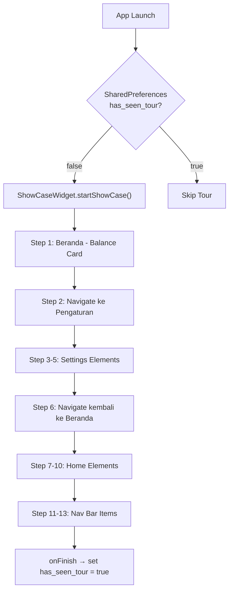

# 🎯 Product Tour — Implementasi dengan ShowcaseView

## Deskripsi
Menambahkan **Product Tour** interaktif yang muncul saat pengguna pertama kali membuka aplikasi. Tour menjelaskan fitur-fitur utama secara berurutan dengan **alur logis**: setup API key dulu, baru kenalkan fitur AI.

---

## Alur Tour (13 Langkah — 4 Fase)

### Fase 1: Selamat Datang 👋 (Beranda)
| Step | Key Name | Target Widget | Judul | Deskripsi |
|------|----------|--------------|-------|-----------|
| 1 | `balanceCard` | `_buildBalanceCard()` di `home_screen.dart` | "Saldo Utama" | "Selamat datang di Noma! Ini ringkasan saldo, pemasukan & pengeluaran Anda." |

### Fase 2: Setup Penting Dulu ⚙️ (Pindah otomatis ke tab Pengaturan)
| Step | Key Name | Target Widget | Judul | Deskripsi |
|------|----------|--------------|-------|-----------|
| 2 | `navPengaturan` | Nav bar item Pengaturan di `main_shell_screen.dart` | "Pengaturan" | "Mari setup aplikasi Anda terlebih dahulu." |
| 3 | `settingsAiKey` | GlassCard AI Key di `settings_screen.dart` (line 261-312) | "Setup API Key AI" | "Langkah penting! Atur API Key Groq & Gemini gratis untuk mengaktifkan semua fitur AI." |
| 4 | `settingsCategory` | GlassCard Manajemen Kategori di `settings_screen.dart` (line 71-109) | "Manajemen Kategori" | "Atur kategori pemasukan & pengeluaran sesuai kebutuhan Anda." |
| 5 | `settingsNotification` | GlassCard Notifikasi di `settings_screen.dart` (line 115-255) | "Pengingat Harian" | "Aktifkan notifikasi harian agar tidak lupa mencatat transaksi." |

### Fase 3: Fitur Utama 🏠 (Pindah otomatis kembali ke tab Beranda)
| Step | Key Name | Target Widget | Judul | Deskripsi |
|------|----------|--------------|-------|-----------|
| 6 | `navBeranda` | Nav bar item Beranda di `main_shell_screen.dart` | "Beranda" | "Kembali ke beranda! Sekarang mari kenali fitur-fiturnya." |
| 7 | `dashboardChart` | `DashboardChartCard()` di `home_screen.dart` (line 64) | "Grafik Keuangan" | "Pantau distribusi pengeluaran dan perbandingan 7 hari terakhir." |
| 8 | `aiSmartInput` | `AiSmartInputCard()` di `home_screen.dart` (line 68) | "Input AI Cerdas" | "Setelah API key aktif, ketik transaksi dengan bahasa alami! Contoh: 'Beli kopi 25rb'." |
| 9 | `quickActions` | `_buildQuickActions()` di `home_screen.dart` (line 72) | "Aksi Cepat" | "Akses cepat ke fitur utama: Tambah, Scan Struk, Nomi AI, dan Laporan." |
| 10 | `recentTx` | `_buildSearchAndFilterBar()` di `home_screen.dart` (line 80) | "Riwayat Transaksi" | "Semua transaksi tercatat di sini. Gunakan pencarian dan filter untuk menemukan transaksi." |

### Fase 4: Navigasi Utama 🧭 (Nav Bar)
| Step | Key Name | Target Widget | Judul | Deskripsi |
|------|----------|--------------|-------|-----------|
| 11 | `navNomiAI` | Nav bar item Nomi AI di `main_shell_screen.dart` | "Nomi AI" | "Chat dengan Nomi, asisten AI keuangan pribadi Anda." |
| 12 | `navTambah` | FAB Tambah (+) di `main_shell_screen.dart` | "Tambah Transaksi" | "Ketuk untuk menambah transaksi: 📸 Scan Struk, 🤖 AI Teks, atau 📝 Manual." |
| 13 | `navLaporan` | Nav bar item Laporan di `main_shell_screen.dart` | "Laporan" | "Lihat laporan dan statistik keuangan lengkap Anda." |

---

## Navigasi Otomatis Antar Tab

Saat tour berpindah fase, halaman harus berpindah otomatis menggunakan callback `onStart`:

```
Step 1     → Halaman Beranda (sudah default)
Step 2     → onStart: panggil _onTabTapped(3) untuk pindah ke Pengaturan
Step 3-5   → Tetap di Pengaturan
Step 6     → onStart: panggil _onTabTapped(0) untuk pindah ke Beranda
Step 7-10  → Tetap di Beranda
Step 11-13 → Tetap di Beranda (target ada di nav bar yang selalu visible)
```

---

## Arsitektur & Alur Data



---

## File yang Perlu Dibuat/Diubah

### File 1: [MODIFY] `pubspec.yaml`
**Path**: `C:\laragon\www\aplikasi-pencatatan-uang\noma\pubspec.yaml`
**Instruksi**: Tambahkan `showcaseview: ^5.1.0` setelah `shared_preferences: ^2.5.5` (line 51).

```diff
   shared_preferences: ^2.5.5
   timezone: ^0.9.4
+  showcaseview: ^5.1.0
```

Lalu jalankan `flutter pub get`.

---

### File 2: [NEW] `lib/core/services/product_tour_service.dart`
**Path**: `C:\laragon\www\aplikasi-pencatatan-uang\noma\lib\core\services\product_tour_service.dart`
**Instruksi**: Buat file baru. Service untuk mengelola state tour menggunakan `SharedPreferences`.

```dart
import 'package:shared_preferences/shared_preferences.dart';

class ProductTourService {
  static const String _keyHasSeenTour = 'has_seen_product_tour';

  /// Cek apakah user sudah melihat product tour
  static Future<bool> hasSeenTour() async {
    final prefs = await SharedPreferences.getInstance();
    return prefs.getBool(_keyHasSeenTour) ?? false;
  }

  /// Tandai product tour sebagai selesai
  static Future<void> markTourAsCompleted() async {
    final prefs = await SharedPreferences.getInstance();
    await prefs.setBool(_keyHasSeenTour, true);
  }

  /// Reset tour (untuk tombol "Ulangi Tour" di Settings)
  static Future<void> resetTour() async {
    final prefs = await SharedPreferences.getInstance();
    await prefs.remove(_keyHasSeenTour);
  }
}
```

---

### File 3: [NEW] `lib/core/constants/product_tour_keys.dart`
**Path**: `C:\laragon\www\aplikasi-pencatatan-uang\noma\lib\core\constants\product_tour_keys.dart`
**Instruksi**: Buat file baru. Kumpulan `GlobalKey` statis untuk semua 13 target showcase.

```dart
import 'package:flutter/material.dart';

/// GlobalKey statis untuk setiap step Product Tour.
/// Menggunakan static agar dapat diakses dari HomeScreen, MainShellScreen & SettingsScreen.
class ProductTourKeys {
  ProductTourKeys._();

  // ── Fase 1: Beranda (Step 1) ──
  static final balanceCard = GlobalKey(debugLabel: 'tour_balance_card');

  // ── Fase 2: Pengaturan (Step 2-5) ──
  static final navPengaturan = GlobalKey(debugLabel: 'tour_nav_pengaturan');
  static final settingsAiKey = GlobalKey(debugLabel: 'tour_settings_ai_key');
  static final settingsCategory = GlobalKey(debugLabel: 'tour_settings_category');
  static final settingsNotification = GlobalKey(debugLabel: 'tour_settings_notification');

  // ── Fase 3: Fitur Utama Beranda (Step 6-10) ──
  static final navBeranda = GlobalKey(debugLabel: 'tour_nav_beranda');
  static final dashboardChart = GlobalKey(debugLabel: 'tour_dashboard_chart');
  static final aiSmartInput = GlobalKey(debugLabel: 'tour_ai_smart_input');
  static final quickActions = GlobalKey(debugLabel: 'tour_quick_actions');
  static final recentTx = GlobalKey(debugLabel: 'tour_recent_transactions');

  // ── Fase 4: Navigasi (Step 11-13) ──
  static final navNomiAI = GlobalKey(debugLabel: 'tour_nav_nomi_ai');
  static final navTambah = GlobalKey(debugLabel: 'tour_nav_tambah');
  static final navLaporan = GlobalKey(debugLabel: 'tour_nav_laporan');

  /// Urutan lengkap 13 tour steps
  static List<GlobalKey> get orderedKeys => [
    // Fase 1: Selamat Datang
    balanceCard,           // Step 1
    // Fase 2: Setup Pengaturan
    navPengaturan,         // Step 2 → trigger pindah ke tab Pengaturan
    settingsAiKey,         // Step 3
    settingsCategory,      // Step 4
    settingsNotification,  // Step 5
    // Fase 3: Fitur Utama
    navBeranda,            // Step 6 → trigger pindah ke tab Beranda
    dashboardChart,        // Step 7
    aiSmartInput,          // Step 8
    quickActions,          // Step 9
    recentTx,              // Step 10
    // Fase 4: Navigasi
    navNomiAI,             // Step 11
    navTambah,             // Step 12
    navLaporan,            // Step 13
  ];
}
```

---

### File 4: [MODIFY] `lib/features/main_shell/presentation/main_shell_screen.dart`
**Path**: `C:\laragon\www\aplikasi-pencatatan-uang\noma\lib\features\main_shell\presentation\main_shell_screen.dart`

#### 4a. Tambah import (setelah line 14)
```dart
import 'package:showcaseview/showcaseview.dart';
import '../../../core/constants/product_tour_keys.dart';
import '../../../core/services/product_tour_service.dart';
```

#### 4b. Tambah state variable (setelah line 34 `bool _isFabExpanded = false;`)
```dart
BuildContext? _showcaseContext;
```

#### 4c. Tambah method `_startTourIfNeeded` (setelah method `_showAiTextInputModal`, sekitar line 108)
```dart
Future<void> _startTourIfNeeded() async {
  final hasSeen = await ProductTourService.hasSeenTour();
  if (!hasSeen && mounted && _showcaseContext != null) {
    ShowCaseWidget.of(_showcaseContext!).startShowCase(
      ProductTourKeys.orderedKeys,
    );
  }
}
```

#### 4d. Tambah `addPostFrameCallback` di `initState` (setelah line 59, di dalam initState)
```dart
WidgetsBinding.instance.addPostFrameCallback((_) => _startTourIfNeeded());
```

#### 4e. Bungkus `Scaffold` dengan `ShowCaseWidget` di method `build` (line 114)
Ganti:
```dart
return Scaffold(
```
Menjadi:
```dart
return ShowCaseWidget(
  onFinish: () => ProductTourService.markTourAsCompleted(),
  onStart: (index, key) {
    // Fase 2: Pindah ke tab Pengaturan saat step 2 dimulai
    if (index == 1 && key == ProductTourKeys.navPengaturan) {
      _onTabTapped(3); // index 3 = Pengaturan
    }
    // Fase 3: Pindah kembali ke tab Beranda saat step 6 dimulai
    if (index == 5 && key == ProductTourKeys.navBeranda) {
      _onTabTapped(0); // index 0 = Beranda
    }
  },
  blurValue: 1.0,
  builder: Builder(
    builder: (ctx) {
      _showcaseContext = ctx;
      return Scaffold(
```
Dan tambahkan penutup `)` yang sesuai di akhir method build:
```dart
          ],
        ),
      ),
    );       // Scaffold close
    },
  ),
);           // ShowCaseWidget close
```

#### 4f. Bungkus setiap nav bar item dengan `Showcase`
Di method `_buildFloatingGlassNavBar`, di dalam `List.generate`, bungkus setiap item navigasi.

**Pemetaan nav index ke GlobalKey:**
- index 0 (Beranda) → `ProductTourKeys.navBeranda`
- index 1 (Nomi AI) → `ProductTourKeys.navNomiAI`
- index 2 (FAB Tambah) → sudah ditangani di `_buildFabItem`
- index 3 (Laporan) → `ProductTourKeys.navLaporan`
- index 4 (Pengaturan) → `ProductTourKeys.navPengaturan`

Untuk setiap nav item (yang bukan FAB), bungkus `BouncyTap` dengan `Showcase`:
```dart
// Tentukan GlobalKey berdasarkan index
final GlobalKey? tourKey;
switch (index) {
  case 0: tourKey = ProductTourKeys.navBeranda; break;
  case 1: tourKey = ProductTourKeys.navNomiAI; break;
  case 3: tourKey = ProductTourKeys.navLaporan; break;
  case 4: tourKey = ProductTourKeys.navPengaturan; break;
  default: tourKey = null;
}

Widget navWidget = BouncyTap(
  onTap: () => _onTabTapped(pageIndex),
  // ... existing code ...
);

// Bungkus dengan Showcase jika punya tourKey
if (tourKey != null) {
  navWidget = Showcase(
    key: tourKey,
    title: item['label'] as String,
    description: _getTourDescription(index),
    targetShapeBorder: const CircleBorder(),
    targetPadding: const EdgeInsets.all(4),
    tooltipBackgroundColor: const Color(0xE61A1A2E),
    titleTextStyle: const TextStyle(
      color: Colors.white,
      fontWeight: FontWeight.bold,
      fontSize: 16,
    ),
    descriptionTextStyle: const TextStyle(
      color: Color(0xD9FFFFFF),
      fontSize: 13,
      height: 1.4,
    ),
    child: navWidget,
  );
}

return navWidget;
```

**Tambah helper method `_getTourDescription`:**
```dart
String _getTourDescription(int navIndex) {
  switch (navIndex) {
    case 0: return 'Kembali ke beranda! Sekarang mari kenali fitur-fiturnya.';
    case 1: return 'Chat dengan Nomi, asisten AI keuangan pribadi Anda.';
    case 3: return 'Lihat laporan dan statistik keuangan lengkap Anda.';
    case 4: return 'Mari setup aplikasi Anda terlebih dahulu.';
    default: return '';
  }
}
```

#### 4g. Bungkus FAB item dengan `Showcase`
Di method `_buildFabItem`, bungkus `BouncyTap` dengan `Showcase`:
```dart
Widget _buildFabItem(BuildContext context) {
  return Showcase(
    key: ProductTourKeys.navTambah,
    title: 'Tambah Transaksi',
    description: 'Ketuk untuk menambah transaksi:\n📸 Scan Struk, 🤖 AI Teks, atau 📝 Manual.',
    targetShapeBorder: const CircleBorder(),
    targetPadding: const EdgeInsets.all(4),
    tooltipBackgroundColor: const Color(0xE61A1A2E),
    titleTextStyle: const TextStyle(
      color: Colors.white,
      fontWeight: FontWeight.bold,
      fontSize: 16,
    ),
    descriptionTextStyle: const TextStyle(
      color: Color(0xD9FFFFFF),
      fontSize: 13,
      height: 1.4,
    ),
    child: BouncyTap(
      // ... existing BouncyTap code tetap sama ...
    ),
  );
}
```

---

### File 5: [MODIFY] `lib/features/home/presentation/home_screen.dart`
**Path**: `C:\laragon\www\aplikasi-pencatatan-uang\noma\lib\features\home\presentation\home_screen.dart`

#### 5a. Tambah import (setelah line 20)
```dart
import 'package:showcaseview/showcaseview.dart';
import '../../../core/constants/product_tour_keys.dart';
```

#### 5b. Bungkus 5 widget di method `build` (line 54-86)

**Konstanta tooltip style** (buat sebagai variabel lokal di atas Column):
```dart
const tourTooltipBg = Color(0xE61A1A2E);
const tourTitleStyle = TextStyle(color: Colors.white, fontWeight: FontWeight.bold, fontSize: 16);
const tourDescStyle = TextStyle(color: Color(0xD9FFFFFF), fontSize: 13, height: 1.4);
```

**Step 1 — Balance Card** (line 60):
```dart
// SEBELUM:
_buildBalanceCard(balanceAsync, incomeAsync, expenseAsync),

// SESUDAH:
Showcase(
  key: ProductTourKeys.balanceCard,
  title: 'Saldo Utama',
  description: 'Selamat datang di Noma! Ini ringkasan saldo, pemasukan & pengeluaran Anda.',
  targetBorderRadius: BorderRadius.circular(24),
  targetPadding: const EdgeInsets.all(4),
  tooltipBackgroundColor: tourTooltipBg,
  titleTextStyle: tourTitleStyle,
  descriptionTextStyle: tourDescStyle,
  child: _buildBalanceCard(balanceAsync, incomeAsync, expenseAsync),
),
```

**Step 7 — Dashboard Chart** (line 64):
```dart
// SEBELUM:
const DashboardChartCard(),

// SESUDAH:
Showcase(
  key: ProductTourKeys.dashboardChart,
  title: 'Grafik Keuangan',
  description: 'Pantau distribusi pengeluaran dan perbandingan 7 hari terakhir.',
  targetBorderRadius: BorderRadius.circular(24),
  targetPadding: const EdgeInsets.all(4),
  tooltipBackgroundColor: tourTooltipBg,
  titleTextStyle: tourTitleStyle,
  descriptionTextStyle: tourDescStyle,
  child: const DashboardChartCard(),
),
```

**Step 8 — AI Smart Input** (line 68):
```dart
// SEBELUM:
const AiSmartInputCard(),

// SESUDAH:
Showcase(
  key: ProductTourKeys.aiSmartInput,
  title: 'Input AI Cerdas',
  description: 'Setelah API key aktif, ketik transaksi dengan bahasa alami!\nContoh: "Beli kopi 25rb".',
  targetBorderRadius: BorderRadius.circular(20),
  targetPadding: const EdgeInsets.all(4),
  tooltipBackgroundColor: tourTooltipBg,
  titleTextStyle: tourTitleStyle,
  descriptionTextStyle: tourDescStyle,
  child: const AiSmartInputCard(),
),
```

**Step 9 — Quick Actions** (line 72):
```dart
// SEBELUM:
_buildQuickActions(context),

// SESUDAH:
Showcase(
  key: ProductTourKeys.quickActions,
  title: 'Aksi Cepat',
  description: 'Akses cepat ke fitur utama: Tambah, Scan Struk, Nomi AI, dan Laporan.',
  targetBorderRadius: BorderRadius.circular(16),
  targetPadding: const EdgeInsets.all(4),
  tooltipBackgroundColor: tourTooltipBg,
  titleTextStyle: tourTitleStyle,
  descriptionTextStyle: tourDescStyle,
  child: _buildQuickActions(context),
),
```

**Step 10 — Search & Filter Bar / Riwayat Transaksi** (line 80):
```dart
// SEBELUM:
_buildSearchAndFilterBar(),

// SESUDAH:
Showcase(
  key: ProductTourKeys.recentTx,
  title: 'Riwayat Transaksi',
  description: 'Semua transaksi tercatat di sini.\nGunakan pencarian dan filter untuk menemukan transaksi.',
  targetBorderRadius: BorderRadius.circular(16),
  targetPadding: const EdgeInsets.all(4),
  tooltipBackgroundColor: tourTooltipBg,
  titleTextStyle: tourTitleStyle,
  descriptionTextStyle: tourDescStyle,
  child: _buildSearchAndFilterBar(),
),
```

---

### File 6: [MODIFY] `lib/features/settings/presentation/settings_screen.dart`
**Path**: `C:\laragon\www\aplikasi-pencatatan-uang\noma\lib\features\settings\presentation\settings_screen.dart`

#### 6a. Tambah import (setelah line 14)
```dart
import 'package:showcaseview/showcaseview.dart';
import '../../../core/constants/product_tour_keys.dart';
import '../../../core/services/product_tour_service.dart';
```

#### 6b. Bungkus 3 GlassCard di method `build`

**Konstanta tooltip style** (buat sebagai variabel lokal di atas ListView):
```dart
const tourTooltipBg = Color(0xE61A1A2E);
const tourTitleStyle = TextStyle(color: Colors.white, fontWeight: FontWeight.bold, fontSize: 16);
const tourDescStyle = TextStyle(color: Color(0xD9FFFFFF), fontSize: 13, height: 1.4);
```

**Step 4 — Manajemen Kategori** (line 71-109, bungkus GlassCard):
```dart
Showcase(
  key: ProductTourKeys.settingsCategory,
  title: 'Manajemen Kategori',
  description: 'Atur kategori pemasukan & pengeluaran sesuai kebutuhan Anda.',
  targetBorderRadius: BorderRadius.circular(20),
  targetPadding: const EdgeInsets.all(4),
  tooltipBackgroundColor: tourTooltipBg,
  titleTextStyle: tourTitleStyle,
  descriptionTextStyle: tourDescStyle,
  child: GlassCard(
    onTap: () => context.push(AppRoutes.categories),
    // ... existing child content tetap sama ...
  ),
),
```

**Step 5 — Notifikasi & Pengingat** (line 115-255, bungkus GlassCard):
```dart
Showcase(
  key: ProductTourKeys.settingsNotification,
  title: 'Pengingat Harian',
  description: 'Aktifkan notifikasi harian agar tidak lupa mencatat transaksi.',
  targetBorderRadius: BorderRadius.circular(20),
  targetPadding: const EdgeInsets.all(4),
  tooltipBackgroundColor: tourTooltipBg,
  titleTextStyle: tourTitleStyle,
  descriptionTextStyle: tourDescStyle,
  child: GlassCard(
    // ... existing child content tetap sama ...
  ),
),
```

**Step 3 — AI Key Setup** (line 261-312, bungkus GlassCard):
```dart
Showcase(
  key: ProductTourKeys.settingsAiKey,
  title: 'Setup API Key AI',
  description: 'Langkah penting! Atur API Key Groq & Gemini gratis untuk mengaktifkan semua fitur AI.',
  targetBorderRadius: BorderRadius.circular(20),
  targetPadding: const EdgeInsets.all(4),
  tooltipBackgroundColor: tourTooltipBg,
  titleTextStyle: tourTitleStyle,
  descriptionTextStyle: tourDescStyle,
  child: GlassCard(
    onTap: () => AiKeySetupModal.show(context),
    // ... existing child content tetap sama ...
  ),
),
```

#### 6c. Tambah tombol "Ulangi Tur Aplikasi" (setelah AI section, sebelum App Branding Card, sekitar line 313)
```dart
const SizedBox(height: 16),
Text('Bantuan', style: AppTypography.labelMedium),
const SizedBox(height: 8),
GlassCard(
  onTap: () async {
    await ProductTourService.resetTour();
    if (mounted) {
      context.go(AppRoutes.home);
    }
  },
  child: Row(
    children: [
      Container(
        padding: const EdgeInsets.all(10),
        decoration: BoxDecoration(
          color: AppColors.info.withValues(alpha: 0.2),
          shape: BoxShape.circle,
        ),
        child: const Icon(
          Icons.help_outline_rounded,
          color: AppColors.info,
          size: 20,
        ),
      ),
      const SizedBox(width: 14),
      Expanded(
        child: Column(
          crossAxisAlignment: CrossAxisAlignment.start,
          children: [
            Text('Ulangi Tur Aplikasi', style: AppTypography.labelLarge),
            Text(
              'Tampilkan panduan fitur aplikasi lagi',
              style: AppTypography.caption,
            ),
          ],
        ),
      ),
      const Icon(
        Icons.chevron_right_rounded,
        color: AppColors.textSecondary,
      ),
    ],
  ),
),
```

---

## Tooltip Design System

Semua tooltip menggunakan tema gelap glassmorphic yang konsisten:

```dart
// Konstanta yang dipakai di semua file
const tourTooltipBg = Color(0xE61A1A2E);   // Dark glass background
const tourTitleStyle = TextStyle(
  color: Colors.white,
  fontWeight: FontWeight.bold,
  fontSize: 16,
);
const tourDescStyle = TextStyle(
  color: Color(0xD9FFFFFF),                 // 85% white
  fontSize: 13,
  height: 1.4,
);

// Di Showcase widget:
overlayColor: Colors.black   // default
overlayOpacity: 0.75          // default
targetPadding: EdgeInsets.all(4)
```

---

## Verification Plan

### Automated Tests
```bash
cd C:\laragon\www\aplikasi-pencatatan-uang\noma
flutter pub get
flutter analyze
```

### Manual Verification
1. **Fresh Install Test**: Uninstall app → Reinstall → Buka app → Tour harus muncul otomatis mulai dari Balance Card
2. **Alur Fase 2**: Setelah step 1, tour otomatis pindah ke tab Pengaturan dan highlight AI Key, Kategori, Notifikasi
3. **Alur Fase 3**: Setelah step 5, tour otomatis pindah kembali ke Beranda dan highlight fitur-fitur utama
4. **Tour Completion**: Setelah step 13, tutup app → Buka lagi → Tour tidak boleh muncul lagi
5. **Reset Tour**: Buka Pengaturan → Tap "Ulangi Tur Aplikasi" → Kembali ke Beranda → Tour muncul lagi
6. **Hot Restart**: Pastikan tidak ada crash setelah hot restart
